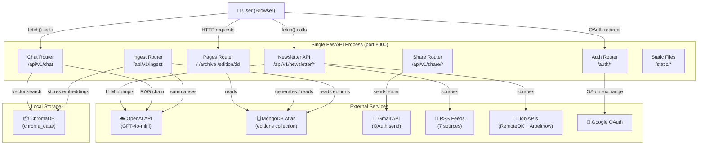

# ⚡ AI Pulse Newsletter

> An AI-powered weekly newsletter platform that automatically curates the latest AI industry news, tools, and career opportunities — with an integrated RAG chatbot for conversational Q&A over all archived editions.

[](https://www.python.org/)
[](https://fastapi.tiangolo.com/)
[](https://www.mongodb.com/atlas)
[](https://platform.openai.com/)
[](https://www.langchain.com/)
[](https://www.trychroma.com/)

---

## 🌐 Live Demo

> 🔗 **Live Demo:** [https://ai-newsletter-ka28.onrender.com](https://ai-newsletter-ka28.onrender.com)

---

## 📖 About the Project

**AI Pulse Newsletter** is a full-stack, production-ready platform for generating, publishing, and interacting with AI-curated newsletters. It solves the problem of information overload in the fast-moving AI industry by automatically:

1. **Scraping** the latest AI news from 7 top RSS feeds (TechCrunch, VentureBeat, WIRED, etc.) and live AI/ML job listings from RemoteOK and Arbeitnow.
2. **Curating** that raw content through OpenAI's GPT models into five structured newsletter sections, each with an AI-generated preview summary.
3. **Publishing** each edition to a responsive web UI with light, dark, and warm themes, a full archive with search, and shareable individual edition pages.
4. **Delivering** newsletters directly to a reader's own Gmail inbox (via the Gmail API) after they log in with Google OAuth.
5. **Answering questions** about any published edition through an embedded RAG chatbot, powered by LangChain, ChromaDB, and OpenAI.

**Who it is for:** AI professionals, researchers, product teams, and anyone who wants a curated, structured weekly digest of what is happening in AI — without manually sifting through dozens of sources.

---

## ✨ Features

### Newsletter Platform
- **AI-powered content generation** — scrapes real articles from 7 RSS feeds and generates 5 curated sections using OpenAI GPT
- **Real job listings** — fetches AI/ML roles from RemoteOK and Arbeitnow with keyword-based relevance filtering
- **Five newsletter sections** — Trending Topics, Top Developments, Corporate AI Tools, Future Requirements & Trends, AI Jobs Board
- **AI-generated section previews** — each section includes a one-sentence description shown in collapsed state
- **Expandable sections** — all sections collapse by default with smooth animations; click to expand
- **Full archive with search** — search across all editions by keyword, year, and month
- **Three UI themes** — Light ☀️, Dark 🌙, and Warm 🍂, with `localStorage` persistence and no flash on load
- **Edition sharing** — logged-in users can email any edition to themselves via their Gmail account
- **Google OAuth login** — signed cookie sessions using `itsdangerous`
- **Responsive design** — mobile-first layout served as Jinja2 templates

### RAG Chatbot
- **Conversational Q&A** — ask any question about newsletter content; the chatbot answers based solely on published editions
- **Floating chat widget** — bottom-right icon embedded on every page, no page reload required
- **Temporal query detection** — understands time references like "AI news in March" or "last month"
- **Source citations** — every answer links back to the source edition and section
- **Conversation memory** — sliding window of the last 5 turns, TTL-based session expiry
- **Auto-ingestion on startup** — new editions are automatically embedded into ChromaDB when the backend starts

---

## 🏗️ Architecture

### High-Level Diagram



### Layer Descriptions

| Layer | Details |
|---|---|
| **Frontend** | Jinja2 HTML templates served by FastAPI. Vanilla JS + CSS (no build step). Three themes via CSS custom properties. |
| **Backend** | FastAPI + Uvicorn. Handles page rendering, newsletter CRUD, Google OAuth, Gmail share, and the RAG chat endpoints. |
| **Chatbot module** | LangChain LCEL pipeline: ChromaDB retriever → `ChatOpenAI` (gpt-4o-mini, temp 0.3) → `StrOutputParser`. Ingestion pipeline summarises each MongoDB section to 300-500 words then embeds via `langchain-chroma`. |
| **Database** | MongoDB Atlas (async `pymongo`). Single `editions` collection with indexes on `edition_number` (unique) and `(status, created_at)`. |
| **LLM** | OpenAI API — `gpt-4o-mini` by default. Used for newsletter section generation (structured JSON output) and chatbot answers. |
| **Email** | Gmail API. Emails are sent using the logged-in user's own Google OAuth `access_token` (scope: `gmail.send`). |
| **Vector store** | ChromaDB, persisted to `./chroma_data/`. Collection: `newsletter_sections`. |
| **News sources** | RSS: TechCrunch, The Verge, VentureBeat, Ars Technica, WIRED, MIT News, Google AI Blog. |
| **Job sources** | REST APIs: RemoteOK, Arbeitnow. Filtered by AI/ML keywords. |

---

## 🛠️ Tech Stack

| Category | Technology | Version |
|---|---|---|
| **Backend framework** | FastAPI | 0.128.x |
| **ASGI server** | Uvicorn | 0.39.x |
| **Database** | MongoDB Atlas (pymongo async) | 4.16.x |
| **Configuration** | Pydantic Settings | 2.11.x |
| **HTTP client** | httpx | 0.28.x |
| **RSS parsing** | feedparser | 6.0.x |
| **Templating** | Jinja2 | 3.1.x |
| **LLM provider** | OpenAI API | — |
| **RAG framework** | LangChain + LangChain-OpenAI | ≥0.3.0 |
| **Vector store** | ChromaDB + langchain-chroma | ≥0.5.0 / ≥0.2.0 |
| **Session signing** | itsdangerous | 2.2.x |
| **Retry logic** | tenacity | ≥8.2.0 |
| **SSL (MongoDB)** | certifi | 2026.x |
| **Frontend** | Vanilla HTML/CSS/JS | — |
| **Auth** | Google OAuth 2.0 | — |
| **Email delivery** | Gmail API | — |
| **Deployment** | Render | — |

---

## 📁 Project Structure

```
AI-Newsletter/
├── backend/                        # Main FastAPI application
│   ├── main.py                     # App entry point; mounts all routers + static files
│   ├── config/
│   │   ├── settings.py             # Pydantic Settings — loads all env vars
│   │   └── templates.py            # Jinja2 template environment config
│   ├── database/
│   │   └── connection.py           # Async MongoDB client + FastAPI lifespan
│   ├── models/
│   │   ├── newsletter.py           # NewsletterEdition, NewsletterSection, ContentItem models
│   │   ├── job.py                  # JobListing model
│   │   └── share.py                # SendToSelfRequest / ShareEmailResponse
│   ├── routers/
│   │   ├── health.py               # GET /api/v1/health
│   │   ├── auth.py                 # Google OAuth (/auth/login, /callback, /logout, /me)
│   │   ├── newsletter.py           # Newsletter CRUD API (/api/v1/newsletter/*)
│   │   ├── share.py                # Email-to-self (/api/v1/share/send-to-self)
│   │   └── pages.py                # Jinja2 HTML page routes (/, /archive, /edition/:id)
│   └── services/
│       ├── content_generator.py    # Orchestrates section-by-section LLM generation
│       ├── llm_client.py           # OpenAI API client with structured JSON output
│       ├── news_scraper.py         # Async RSS feed scraper (7 feeds)
│       ├── jobs_scraper.py         # AI job listings scraper (RemoteOK + Arbeitnow)
│       ├── jobs_service.py         # Formats jobs into newsletter section
│       ├── newsletter_service.py   # MongoDB CRUD for editions (create, get, archive, search)
│       ├── email_service.py        # Gmail API email builder + sender
│       └── rate_limiter.py         # In-memory rate limiter for share endpoint
│
├── chatbot/                        # RAG chatbot module (embedded in backend)
│   ├── main.py                     # Standalone chatbot entry point (optional)
│   ├── config/
│   │   └── settings.py             # Chatbot-specific settings (ChromaDB paths, ports)
│   ├── ingestion/
│   │   ├── ingest.py               # Pipeline: MongoDB → summarise → embed in ChromaDB
│   │   ├── embedder.py             # ChromaDB vector store initialisation + storage
│   │   └── summarizer.py           # OpenAI section summarisation with tenacity retry
│   ├── retrieval/
│   │   ├── chain.py                # LangChain LCEL chain (retriever → LLM → parser)
│   │   └── vector_store.py         # ChromaDB retriever abstraction with metadata filtering
│   ├── models/
│   │   └── schemas.py              # ChatRequest, ChatResponse, IngestionResult schemas
│   ├── routers/
│   │   └── chat.py                 # POST /api/v1/chat, POST /api/v1/ingest
│   └── services/
│       └── chat_service.py         # Chat orchestration, session management, temporal parsing
│
├── frontend/                       # Jinja2 templates + static assets
│   ├── templates/
│   │   ├── base.html               # Base layout (header, footer, chat widget, CSS/JS)
│   │   ├── index.html              # Homepage — latest edition view
│   │   ├── archive.html            # Archive listing with search and month filters
│   │   ├── edition.html            # Individual edition full-page view
│   │   ├── empty.html              # Empty state (no editions yet)
│   │   └── partials/
│   │       ├── header.html         # Site header (nav, theme toggle, Google login)
│   │       ├── footer.html         # Site footer
│   │       ├── chat_widget.html    # Floating chat panel HTML
│   │       ├── section_trending.html
│   │       ├── section_developments.html
│   │       ├── section_tools.html
│   │       ├── section_future.html
│   │       ├── section_jobs.html
│   │       └── share_button.html
│   └── static/
│       ├── css/
│       │   ├── reset.css           # CSS reset
│       │   ├── typography.css      # Fonts and text styles
│       │   ├── layout.css          # Page structure and grid
│       │   ├── sections.css        # Newsletter section cards
│       │   ├── auth.css            # Login button and profile dropdown
│       │   ├── chat.css            # Chat widget styles
│       │   └── responsive.css      # Breakpoints and mobile layout
│       └── js/
│           ├── theme.js            # Three-theme toggle with localStorage
│           ├── auth.js             # Google login state, profile dropdown
│           ├── chat.js             # Chat widget client (fetch → /api/v1/chat)
│           ├── sections.js         # Expand/collapse section animations
│           ├── share.js            # Send-to-self email flow
│           ├── archive.js          # Archive search and filter logic
│           └── smooth-scroll.js    # Smooth anchor scrolling
│
├── requirements.txt                # All Python dependencies
├── .env.example                    # Environment variable template
├── .gitignore
└── AI_Newsletter_Documentation.pdf # Project documentation
```

---

## 🚀 Getting Started

For the complete step-by-step setup, see **[SETUP_GUIDE.md](SETUP_GUIDE.md)**.

### Quickstart

```bash
# 1. Clone the repository
git clone https://github.com/tanmayiitj/AI-Newsletter.git
cd AI-Newsletter

# 2. Create and activate a virtual environment
python -m venv .venv
source .venv/bin/activate        # macOS/Linux
# .venv\Scripts\activate         # Windows

# 3. Install dependencies
pip install -r requirements.txt

# 4. Configure environment variables
cp .env.example .env
# Edit .env with your MongoDB URI, OpenAI API key, and other credentials

# 5. Start the backend (serves frontend + API + chatbot on one port)
uvicorn backend.main:app --host 0.0.0.0 --port 8000

# 6. Open the app
# http://localhost:8000
```

---

## 🔑 Environment Variables

Copy `.env.example` to `.env` and fill in every value before running.

| Variable | Description | Required | Where to get it |
|---|---|---|---|
| `MONGODB_URI` | Full MongoDB connection string | ✅ Yes | MongoDB Atlas → Connect → Drivers |
| `MONGODB_DB_NAME` | Database name (default: `ai_pulse`) | No | Any name you choose |
| `OPENAI_API_KEY` | OpenAI secret key | ✅ Yes | [platform.openai.com/api-keys](https://platform.openai.com/api-keys) |
| `OPENAI_MODEL` | Model to use (default: `gpt-4o-mini`) | No | Any chat model name |
| `ADMIN_API_KEY` | Secret key for protected admin endpoints | ✅ Yes | Generate: `python -c "import secrets; print(secrets.token_urlsafe(32))"` |
| `APP_ENV` | `development` or `production` | No | Set manually |
| `APP_PORT` | Server port (default: `8000`) | No | Set manually |
| `GOOGLE_CLIENT_ID` | Google OAuth 2.0 client ID | ✅ For auth/email | [console.cloud.google.com](https://console.cloud.google.com/apis/credentials) |
| `GOOGLE_CLIENT_SECRET` | Google OAuth 2.0 client secret | ✅ For auth/email | Same as above |
| `GOOGLE_REDIRECT_URI` | OAuth callback URL | No | Set to `http://localhost:8000/auth/callback` for local dev |
| `SESSION_SECRET_KEY` | Key for signing session cookies | ✅ Yes | Generate: `python -c "import secrets; print(secrets.token_urlsafe(32))"` |
| `SESSION_MAX_AGE` | Session lifetime in seconds (default: `86400` = 24 h) | No | Set manually |
| `RATE_LIMIT_MAX_REQUESTS` | Max share emails per user per window (default: `3`) | No | Set manually |
| `RATE_LIMIT_WINDOW_SECONDS` | Rate-limit window in seconds (default: `600`) | No | Set manually |

> **Note:** `GOOGLE_CLIENT_ID` / `GOOGLE_CLIENT_SECRET` are only required if you want Google login and the email-to-self feature. The newsletter generation and chatbot work without them.

---

## 📡 API Endpoints

All endpoints are served from the single backend process (default port **8000**).

### Pages (HTML)

| Method | Endpoint | Description |
|---|---|---|
| `GET` | `/` | Homepage — latest newsletter edition |
| `GET` | `/archive` | Archive page with search and month filter |
| `GET` | `/edition/{edition_id}` | Full view of a single edition |

### Newsletter

| Method | Endpoint | Auth | Description |
|---|---|---|---|
| `POST` | `/api/v1/newsletter/generate` | `X-API-Key` header | Trigger AI generation of a new edition |
| `GET` | `/api/v1/newsletter/latest` | — | Latest published edition (JSON) |
| `GET` | `/api/v1/newsletter/archive` | — | Paginated edition list (`?page=1&per_page=10`) |
| `GET` | `/api/v1/newsletter/search` | — | Search editions (`?q=&year=&month=&limit=10`) |
| `GET` | `/api/v1/newsletter/months` | — | Available publication years |
| `GET` | `/api/v1/newsletter/{edition_id}` | — | Specific edition by MongoDB ID (JSON) |

### Authentication

| Method | Endpoint | Description |
|---|---|---|
| `GET` | `/auth/login` | Redirect to Google OAuth consent screen |
| `GET` | `/auth/callback` | Handle OAuth callback; set session cookie |
| `POST` | `/auth/logout` | Clear session cookie |
| `GET` | `/auth/me` | Return current user profile (401 if not logged in) |

### Share

| Method | Endpoint | Auth | Description |
|---|---|---|---|
| `POST` | `/api/v1/share/send-to-self` | Session cookie | Send the edition to your own Gmail inbox |

### Chatbot

| Method | Endpoint | Auth | Description |
|---|---|---|---|
| `POST` | `/api/v1/chat` | — | Send a message; returns RAG-powered answer + source citations |
| `POST` | `/api/v1/ingest` | `X-API-Key` header | Ingest newsletters into ChromaDB (`?full_reindex=false`) |

### Health

| Method | Endpoint | Description |
|---|---|---|
| `GET` | `/api/v1/health` | Returns `healthy` + MongoDB connectivity status |

---

## 🤖 Chatbot Module

The RAG chatbot is embedded directly into the main backend (no separate process needed). It is accessible via the floating chat icon on every page, or programmatically via the API.

### How it works

1. **Ingestion** — When the backend starts, it auto-runs an incremental ingestion: each published edition in MongoDB is summarised per section (300–500 words using OpenAI), then embedded into a local ChromaDB collection (`newsletter_sections`). Only editions not yet indexed are processed.
2. **Query** — When the user submits a question, the chatbot service parses any temporal references (e.g., "March", "this month"), builds an optional metadata filter, and retrieves the top 5 most relevant section summaries from ChromaDB.
3. **Answer** — A LangChain LCEL chain passes the retrieved context, chat history (last 5 turns), and the question to `gpt-4o-mini`, which replies in a grounded, citation-aware style.
4. **Citations** — The response includes source metadata (edition number, section title, publication date) rendered as clickable links in the chat widget.

### Chat API

**Request:**
```json
{
  "message": "What AI tools were mentioned in the latest edition?",
  "session_id": "optional-uuid-for-conversation-continuity"
}
```

**Response:**
```json
{
  "answer": "Based on Edition #3, the corporate AI tools section highlighted...",
  "sources": [
    {
      "edition_id": "65f3a...",
      "edition_number": 3,
      "section_type": "corporate_tools",
      "section_title": "Corporate AI Tools",
      "published_at": "2026-03-15T00:00:00"
    }
  ],
  "session_id": "uuid"
}
```

### Admin ingestion

```bash
# Incremental (only new editions)
curl -X POST http://localhost:8000/api/v1/ingest \
  -H "X-API-Key: YOUR_ADMIN_API_KEY"

# Full re-index (re-embed everything)
curl -X POST "http://localhost:8000/api/v1/ingest?full_reindex=true" \
  -H "X-API-Key: YOUR_ADMIN_API_KEY"
```

---

## 🖼️ Screenshots

> Add screenshots of the UI here — homepage, archive page, chat widget open, dark theme, email share dialog.

---

## 🗺️ Roadmap

- [ ] Scheduled automatic newsletter generation (cron / APScheduler)
- [ ] Email subscription list with opt-in/opt-out management
- [ ] Multiple LLM provider support (Gemini, Claude, local models)
- [ ] Webhook or push notifications when a new edition is published
- [ ] Admin dashboard for managing editions and monitoring generation status
- [ ] RSS/Atom feed output for the newsletter archive

---

## 🤝 Contributing

1. Fork the repository
2. Create a feature branch: `git checkout -b feature/your-feature-name`
3. Commit your changes: `git commit -m "feat: add your feature"`
4. Push to the branch: `git push origin feature/your-feature-name`
5. Open a Pull Request targeting the `001-ai-pulse-newsletter` branch

Please keep PRs focused and include a clear description of what changed and why.

---

## 📄 License

This project is currently unlicensed. Consider adding an [MIT](https://opensource.org/licenses/MIT) or [Apache-2.0](https://opensource.org/licenses/Apache-2.0) license.

---

## 👤 Author

**Tanmay** — GitHub: <a href="https://github.com/tanmayiitj">@tanmayiitj</a>

---

## 🙏 Acknowledgements

- [FastAPI](https://fastapi.tiangolo.com/) — high-performance Python web framework
- [OpenAI](https://openai.com/) — LLM API powering content generation and chatbot answers
- [LangChain](https://www.langchain.com/) — RAG framework and LCEL chain composition
- [ChromaDB](https://www.trychroma.com/) — local vector store for semantic search
- [MongoDB Atlas](https://www.mongodb.com/atlas) — managed cloud database
- [Pydantic](https://docs.pydantic.dev/) — data validation and settings management
- [feedparser](https://feedparser.readthedocs.io/) — RSS feed parsing
- [itsdangerous](https://itsdangerous.palletsprojects.com/) — secure session signing
- [RemoteOK](https://remoteok.com/) and [Arbeitnow](https://www.arbeitnow.com/) — job listing APIs
